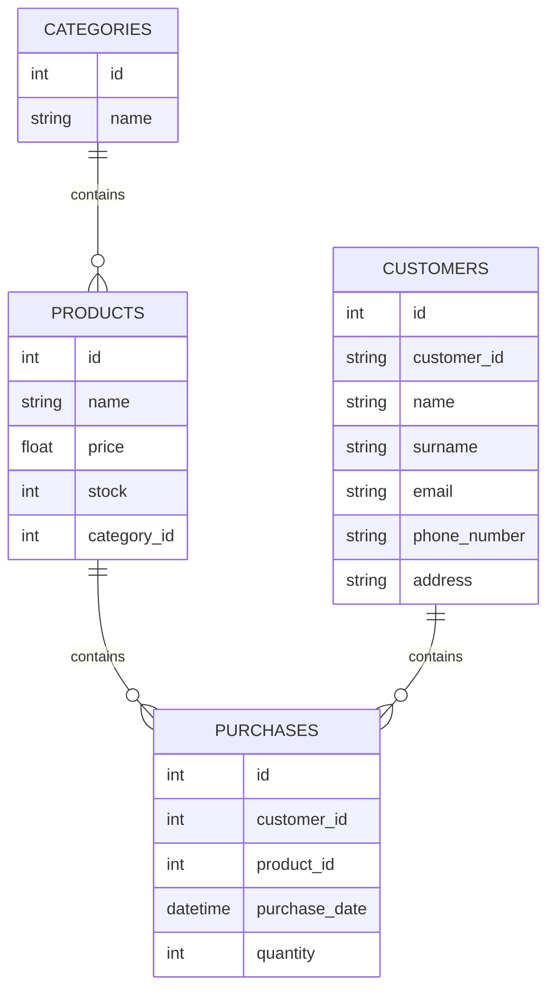

# Gestione Magazzino - Documentazione Progetto

## Indice
1. [Stato Attuale](#stato-attuale)
2. [Implementazioni Future](#implementazioni-future)
3. [Divisione dei Compiti](#divisione-dei-compiti)

## Stato Attuale

### Database Structure
Attualmente il database SQLite contiene due tabelle principali:

#### Tabella `categorie`
```sql
CREATE TABLE categorie (
    id INTEGER PRIMARY KEY AUTOINCREMENT, 
    name TEXT UNIQUE
);
```

#### Tabella `prodotti`
```sql
CREATE TABLE prodotti (
    id INTEGER PRIMARY KEY AUTOINCREMENT, 
    name TEXT UNIQUE, 
    price REAL, 
    stock INTEGER CHECK (stock >= 0), 
    category_id INTEGER, 
    FOREIGN KEY (category_id) REFERENCES categories(id)
);
```

### Funzionalità Attuali
- Visualizzazione prodotti (semplice e con categorie)
- Ordinamento prodotti per prezzo e quantità
- Modifica prezzo prodotti
- Eliminazione prodotti
- Visualizzazione prodotto più/meno costoso
- Gestione delle categorie (inserimento/eliminazione)
- Inserimento prodotti (con e senza categoria)

## Implementazioni Future

### 1. Estensione Database
#### Nuova Tabella `clienti`
```sql
CREATE TABLE customers (
                id INTEGER PRIMARY KEY AUTOINCREMENT, 
                name TEXT, 
                surname TEXT, 
                email TEXT UNIQUE, 
                phone_number TEXT, 
                address TEXT, 
                client_code TEXT UNIQUE
            );
```

### 2. Ristrutturazione MVC
#### Model
- `Entity.cs`
- `Customer.cs`
- `Product.cs`
- `Category.cs`
- `Purchase.cs`

#### View
- `ClienteView.cs`
- `ProdottoView.cs`
- `CategoriaView.cs`

#### Controller
- `ClienteController.cs`
- `ProdottoController.cs`
- `CategoriaController.cs`

### 3. Estensione Database
#### Nuova Tabella `purchases`
```sql
CREATE TABLE IF NOT EXISTS purchases (
            id INTEGER PRIMARY KEY AUTOINCREMENT, 
            client_id INTEGER, 
            product_id INTEGER, 
            purchase_date DATETIME DEFAULT CURRENT_TIMESTAMP, 
            quantity INTEGER CHECK (quantity > 0),
            FOREIGN KEY (client_id) REFERENCES clients(id), 
            FOREIGN KEY (product_id) REFERENCES products(id)
        );
```
## Divisione dei Compiti

### Sviluppatore 1 - Mattia Totonchi: 

<details>
<summary>Task 1: Database Extension 1</summary>

**Branch**: `feature/creazione tabella clienti`
- [x] Creazione tabella `clienti`
- [x]  Test integrità database

</details>

<details>
<summary>Task 2: Adding Close Connection </summary>

- [x] Implementazione della chiusura della connessione al database
</details>

<details>
<summary>Task 3: Database Extension 2</summary>

**Branch**: `feature/creazione tabella acquisti`
- [x] Creazione tabella `purchases`
- [x] Implementazione delle relazioni necessarie
- [x] Test integrità database
- [x] Refactor del Database: spostamento da Program.cs a Database.cs
</details>

<details>
<summary>Task 4: Reorganizing MainMenu: Controller </summary>

</details>


### Sviluppatore 2 - Francesco Basevi: 
<details>
<summary>Task 1: MVC Implementation</summary>

**Branch**: `feature/mvc-implementation`

- [x] Ristrutturazione del codice esistente in pattern MVC
- [x] Traduzione del progetto originale da Italiano a Inglese
</details>

<details>
<summary>Task 2: Suddivisione della View basato sui Model</summary>

- [x] `CustomerView.cs`: nuova view per `Customer`
- [x] `ProductView.cs`: nuova view per `Product`
- [x] `PurchaseView.cs`: nuova view per `Purchase`

</details>

<details>
<summary>Task 3: Reorganizing MainMenu: View </summary>
</details>

### Sviluppatore 3 - Allison Timossi + Serghej Ivaldi: 

<details>
<summary>Principal Task : Documentation & Coordination </summary>

**Branch**: `README-updating`

- Supervisione generale del progetto
- Mantenimento README.md **ad ogni implementazione**
- Coordinamento merge requests
</details>

<details>
<summary>Task 1: Models Documentation</summary>

**Branch**: `feature/modelName-model`
    - [x] Entity.cs
    - [x] Customer.cs
    - [x] Product.cs
    - [x] Purchase.cs
</details>

<details>
<summary>Task 2: Suddivisione del Controller basato sui Model</summary>

- [x] `CustomerController.cs`: nuovo controller per `Customer`
- [x] `ProductController.cs.cs`: nuovo controller per `Product`
- [x] `PurchaseController.cs`: nuovo controller per `Purchase`
</details>

<details>
<summary>Task 3: Reorganizing MainMenu: MyView </summary>

- [x] Rendere MainMenu più semplice: 
```csharp
    public void ShowMainMenu(){
        Console.WriteLine("1 - Manage Products");
        Console.WriteLine("2 - Manage Categories");
        Console.WriteLine("3 - Manage Customers");
        Console.WriteLine("4 - Manage Purchases");
        Console.WriteLine("5 - Exit");
    }
```
</details>


## Workflow Git

### Branch Strategy
```
main
├── feature/database-extension
├── feature/mvc-implementation
└── docs/README-updating
```

### Processo di Merge
1. Sviluppo su branch feature
2. Code review
3. Testing
4. Merge su main

## Modelli UML

### Database Schema



## Setup Ambiente di Sviluppo
1. Clonare il repository
2. Installare .NET SDK
3. Installare il package SQLite:
```bash
dotnet add package System.Data.SQLite
```