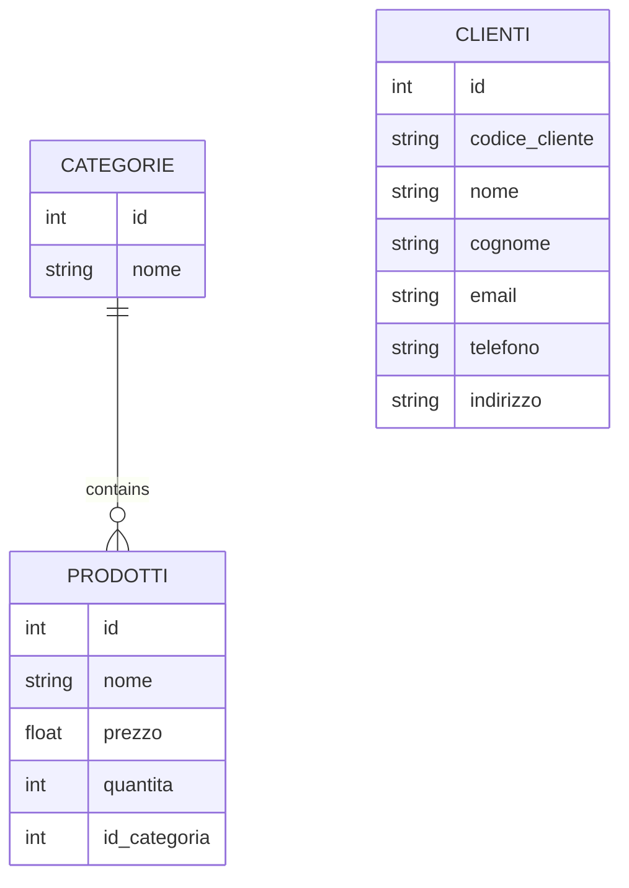

# Gestione Magazzino - Documentazione Progetto

## Indice
1. [Stato Attuale](#stato-attuale)
2. [Implementazioni Future](#implementazioni-future)
3. [Divisione dei Compiti](#divisione-dei-compiti)

## Stato Attuale

### Database Structure
Attualmente il database SQLite contiene due tabelle principali:

#### Tabella `categorie`
```sql
CREATE TABLE categorie (
    id INTEGER PRIMARY KEY AUTOINCREMENT, 
    nome TEXT UNIQUE
);
```

#### Tabella `prodotti`
```sql
CREATE TABLE prodotti (
    id INTEGER PRIMARY KEY AUTOINCREMENT, 
    nome TEXT UNIQUE, 
    prezzo REAL, 
    quantita INTEGER CHECK (quantita >= 0), 
    id_categoria INTEGER,
    FOREIGN KEY (id_categoria) REFERENCES categorie(id)
);
```

### Funzionalità Attuali
- Visualizzazione prodotti (semplice e con categorie)
- Ordinamento prodotti per prezzo e quantità
- Modifica prezzo prodotti
- Eliminazione prodotti
- Visualizzazione prodotto più/meno costoso
- Gestione delle categorie (inserimento/eliminazione)
- Inserimento prodotti (con e senza categoria)

## Implementazioni Future

### 1. Estensione Database
#### Nuova Tabella `clienti`
```sql
CREATE TABLE clienti (
    id INTEGER PRIMARY KEY AUTOINCREMENT,
    codice_cliente TEXT UNIQUE,
    nome TEXT,
    cognome TEXT,
    email TEXT,
    telefono TEXT,
    indirizzo TEXT
);
```

### 2. Ristrutturazione MVC
#### Model
- `Cliente.cs`
- `Prodotto.cs`
- `Categoria.cs`

#### View
- `ClienteView.cs`
- `ProdottoView.cs`
- `CategoriaView.cs`

#### Controller
- `ClienteController.cs`
- `ProdottoController.cs`
- `CategoriaController.cs`

## Divisione dei Compiti

### Sviluppatore 1: Database Extension
- Creazione tabella `clienti`
- Implementazione delle relazioni necessarie
- Test integrità database
- **Branch**: `feature/database-extension`

### Sviluppatore 2: MVC Implementation
- Ristrutturazione del codice esistente in pattern MVC
- Implementazione nuovo controller per `clienti`
- Implementazione delle relative view
- **Branch**: `feature/mvc-implementation`

### Sviluppatore 3: Documentation & Coordination
- Mantenimento README.md
- Coordinamento merge requests
- Documentazione dei modelli
- Supervisione generale del progetto
- **Branch**: `docs/project-documentation`

## Workflow Git

### Branch Strategy
```
main
├── feature/database-extension
├── feature/mvc-implementation
└── docs/project-documentation
```

### Processo di Merge
1. Sviluppo su branch feature
2. Code review
3. Testing
4. Merge su main

## Modelli UML

### Database Schema



## Setup Ambiente di Sviluppo
1. Clonare il repository
2. Installare .NET SDK
3. Installare il package SQLite:
```bash
dotnet add package System.Data.SQLite
```