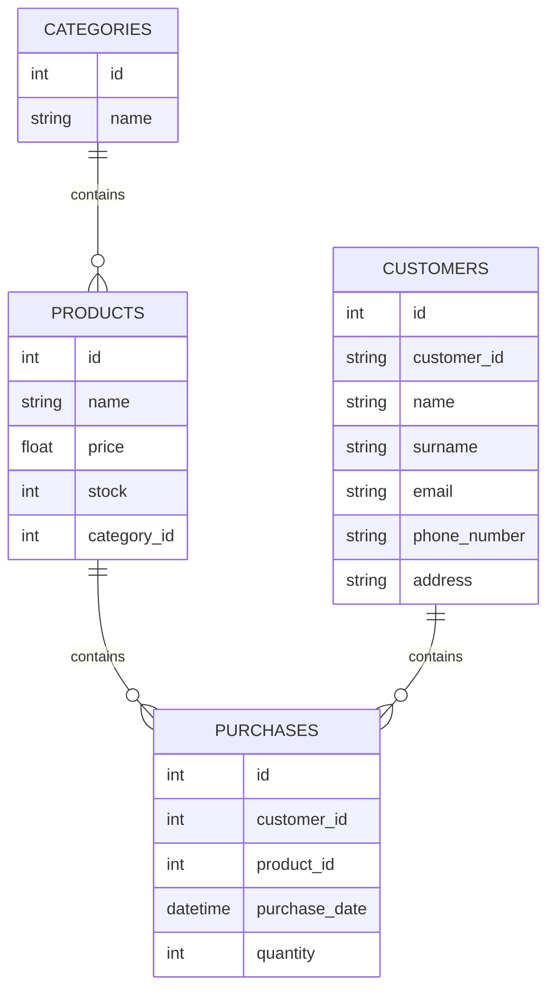

# Gestione Magazzino - Documentazione Progetto

## Indice
1. [Stato Attuale](#stato-attuale)
2. [Implementazioni Future](#implementazioni-future)
3. [Divisione dei Compiti](#divisione-dei-compiti)

## Stato Attuale

### Database Structure
Attualmente il database SQLite contiene due tabelle principali:

#### Tabella `categorie`
```sql
CREATE TABLE categorie (
    id INTEGER PRIMARY KEY AUTOINCREMENT, 
    name TEXT UNIQUE
);
```

#### Tabella `prodotti`
```sql
CREATE TABLE prodotti (
    id INTEGER PRIMARY KEY AUTOINCREMENT, 
    name TEXT UNIQUE, 
    price REAL, 
    stock INTEGER CHECK (stock >= 0), 
    category_id INTEGER, 
    FOREIGN KEY (category_id) REFERENCES categories(id)
);
```

### Funzionalità Attuali
- Visualizzazione prodotti (semplice e con categorie)
- Ordinamento prodotti per prezzo e quantità
- Modifica prezzo prodotti
- Eliminazione prodotti
- Visualizzazione prodotto più/meno costoso
- Gestione delle categorie (inserimento/eliminazione)
- Inserimento prodotti (con e senza categoria)

## Implementazioni Future

### 1. Estensione Database
#### Nuova Tabella `clienti`
```sql
CREATE TABLE customers (
                id INTEGER PRIMARY KEY AUTOINCREMENT, 
                name TEXT, 
                surname TEXT, 
                email TEXT UNIQUE, 
                phone_number TEXT, 
                address TEXT, 
                client_code TEXT UNIQUE
            );
```

### 2. Ristrutturazione MVC
#### Model
- `Entity.cs`
- `Customer.cs`
- `Product.cs`
- `Category.cs`
- `Purchase.cs`

#### View
- `ClienteView.cs`
- `ProdottoView.cs`
- `CategoriaView.cs`

#### Controller
- `ClienteController.cs`
- `ProdottoController.cs`
- `CategoriaController.cs`

### 3. Estensione Database
#### Nuova Tabella `purchases`
```sql
CREATE TABLE IF NOT EXISTS purchases (
            id INTEGER PRIMARY KEY AUTOINCREMENT, 
            client_id INTEGER, 
            product_id INTEGER, 
            purchase_date DATETIME DEFAULT CURRENT_TIMESTAMP, 
            quantity INTEGER CHECK (quantity > 0),
            FOREIGN KEY (client_id) REFERENCES clients(id), 
            FOREIGN KEY (product_id) REFERENCES products(id)
        );
```
### 4. Conversione a Entity Framework

<details>
<summary>1 - Comandi per installazione dei pacchetti: </summary>

```bash
dotnet add package Microsoft.EntityFrameworkCore
```

```bash
dotnet add package Microsoft.EntityFrameworkCore.Sqlite
```
// dipendenza per poter usare il comando dotnet ef database update
```bash
dotnet add package Microsoft.EntityFrameworkCore.Design
```
// Se non dovesse andare aggiungere il pacchetto Microsoft.EntityFrameworkCore.Tools
```bash
dotnet add package Microsoft.EntityFrameworkCore.Tools
```
// installare ef globalmente (Che serve per eseguire i comandi ef)
```bash
dotnet tool install --global dotnet-ef
```
</details>

<details>
<summary>2 - Comandi per migrazione: </summary>

Eseguire la migrazione del database

```bash
dotnet ef migrations add InitialCreate
```
Eseguire l'aggiornamento del database
```bash
dotnet ef database update
```
</details>

<details>
<summary>3 - In Database.cs </summary>

-[x] Estensione della classe DbContext con Database
```csharp
class Database : DbContext
{
    //Aggiunta delle proprietà basate sui modelli
    private DbSet<Customer> _customers { get; set; }
    private DbSet<Category> _categories { get; set; }
    private DbSet<Product> _products { get; set; }
    private DbSet<Purchase> _purchases { get; set; }

    public DbSet<User> Users { get; set; } // Tabella degli utenti

    protected override void OnConfiguring(DbContextOptionsBuilder options)
    {
        options.UseSqlite("Data Source=database.db"); // Usa un database SQLite
    }
}

```
-[x] Rimozione del metodo CreateDatabase
</details>

<details>
<summary>4 - Conversione dei singoli metodi a Entity </summary>


In Database.cs: 
<details> <summary> Metodo AddCustomer </summary>

```csharp
//PRIMA
public void AddCustomer(string name, string surname, string email, string phoneNumber, string address, string clientCode)
    {
        string sql = "INSERT INTO customers (name, surname, email, phone_number, address, client_code) VALUES (@name, @surname, @email, @phoneNumber, @address, @clientCode)";
        OpenConnection();
        using var command = new SQLiteCommand(sql, _connection);
        command.Parameters.AddWithValue("@name", name);
        command.Parameters.AddWithValue("@surname", surname);
        command.Parameters.AddWithValue("@email", email);
        command.Parameters.AddWithValue("@phoneNumber", phoneNumber);
        command.Parameters.AddWithValue("@address", address);
        command.Parameters.AddWithValue("@clientCode", clientCode);
        command.ExecuteNonQuery();
    }
//DOPO
public void AddCustomer(string name, string surname, string email, Int64 phoneNumber, string address, string clientCode)
{
    _customers.Add(new Customer { Name = name, Surname = surname, Email = email, PhoneNumber = phoneNumber, Address = address, ClientCode = clientCode });
    SaveChanges();
}
```
</details>

<details> <summary> Metodo GetCustomer </summary>

```csharp
//PRIMA
public SQLiteDataReader GetCustomers()
    {
        string sql = "SELECT * FROM customers"; 
        OpenConnection();
        var command = new SQLiteCommand(sql, _connection);
        return command.ExecuteReader();
    }
//DOPO
public List<Customer> GetCustomers()
{
    return Customers.ToList();
}
```
</details>

<details> <summary> Metodo UpdateCustomer </summary>

```csharp
//PRIMA
public void UpdateCustomer(int id, string newName)
    {
        string sql = $"UPDATE customers SET name = '{newName}' WHERE id = {id}";
        OpenConnection();
        using var command = new SQLiteCommand(sql, _connection);
        command.ExecuteNonQuery();
    }
//DOPO
public void UpdateCustomer(int id, string newName)
    {
        foreach (Customer c in Customers)
        {
            if (c.Id == id)
            {
                c.Name = newName;
            }
        }
        SaveChanges();
    }
```
</details>

<details> <summary> Metodo DeleteCustomer </summary>

```csharp
//PRIMA
public void DeleteCustomer(int id)
    {
        string sql = $"DELETE FROM customers WHERE id = '{id}'";
        OpenConnection();
        using var command = new SQLiteCommand(sql, _connection);
        command.ExecuteNonQuery();
    }
//DOPO
public void DeleteCustomer(int id)
{
    foreach(Customer c in Customers)
    {
        if (c.Id == id)
        {
            Customers.Remove(c);
        }
    }
    SaveChanges();
}
```
</details>

</details>

In CustomerController.cs: 
<details> <summary> Metodo AddCustomer </summary>

```csharp
//PRIMA
private void AddCustomer()
{
    Console.WriteLine("Insert customer's name");
    string name = Console.ReadLine()!;
    Console.WriteLine("Insert customer's surname");
    string surname = Console.ReadLine()!;
    Console.WriteLine("Insert customer's email");
    string email = Console.ReadLine()!;
    Console.WriteLine("Insert customer's address");
    string address = Console.ReadLine()!;
    Console.WriteLine("Insert customer's phone number");
    string phoneNumber = Console.ReadLine()!;
    Console.WriteLine("Insert customer's code");
    string clientCode = Console.ReadLine()!;
    _database.AddCustomer(name, surname, email, phoneNumber, address, clientCode);
    _database.CloseConnection();
}
//DOPO
 private void AddCustomer()
{
    Console.WriteLine("Insert customer's name");
    string name = Console.ReadLine()!;
    Console.WriteLine("Insert customer's surname");
    string surname = Console.ReadLine()!;
    Console.WriteLine("Insert customer's email");
    string email = Console.ReadLine()!;
    Console.WriteLine("Insert customer's address");
    string address = Console.ReadLine()!;
    Console.WriteLine("Insert customer's phone number");
    Int64 phoneNumber = Convert.ToInt64(Console.ReadLine()!);
    Console.WriteLine("Insert customer's code");
    string clientCode = Console.ReadLine()!;
    _database.AddCustomer(name, surname, email, phoneNumber, address, clientCode);
    //_database.CloseConnection();
}
```
</details>

<details> <summary> Metodo ShowCustomer </summary>

```csharp
//PRIMA
private void ShowCustomers()
{
    using var reader = _database.GetCustomers();
    while (reader.Read())
    {
        _customerView.ShowCustomer(reader["id"].ToString(), reader["name"].ToString(), reader["surname"].ToString(), reader["email"].ToString(), reader["phone_number"].ToString(), reader["address"].ToString());
    }
    _database.CloseConnection();
    Console.ReadKey();
}
//DOPO
private void ShowCustomers()
{
    List<Customer> customers = _database.GetCustomers();
    foreach (Customer c in customers)
    {
        _customerView.ShowCustomer(c.Id.ToString(), c.Name.ToString(), c.Surname.ToString(), c.Email.ToString(),c.PhoneNumber.ToString(), c.Address.ToString());
    }
    //_database.CloseConnection();
    Console.ReadKey();
}
```

<details> <summary> Metodo UpdateCustomer </summary>

```csharp
//PRIMA
private void UpdateCustomer()
{
    ShowCustomers();  
    Console.WriteLine("Insert ID's customer");

    if (!int.TryParse(Console.ReadLine()!, out int id))
    {
        Console.WriteLine("Non valid ID.");
        return;
    }

    Console.WriteLine("Insert new customer's name");
    var newName = Console.ReadLine()!;

    if (string.IsNullOrWhiteSpace(newName))
    {
        Console.WriteLine("Name cannot be null");
        return;
    }

    _database.UpdateCustomer(id, newName);

    Console.WriteLine("Customer updated");
    _database.CloseConnection();
    Console.ReadKey();
}
//DOPO
private void UpdateCustomer()
{
ShowCustomers();
Console.WriteLine("Insert ID's customer");
var id = Convert.ToInt32(Console.ReadLine()!);
/*
if (!int.TryParse(Console.ReadLine()!, out int id))
{
    Console.WriteLine("Non valid ID.");
    return;
}
*/
Console.WriteLine("Insert new customer's name");
var newName = Console.ReadLine()!;

if (string.IsNullOrWhiteSpace(newName))
{
    Console.WriteLine("Name cannot be null");
    return;
}

_database.UpdateCustomer(id, newName);

Console.WriteLine("Customer updated");
//_database.CloseConnection();
Console.ReadKey();
}
```
</details>

</details>

<details> <summary> Metodo DeleteCustomer </summary>

```csharp
//PRIMA
private void DeleteCustomer()
{
    ShowCustomers();
    Console.WriteLine("Insert customer's ID");
    string id = Console.ReadLine()!;

    if (!int.TryParse(id, out int idConverted))
    {
        Console.WriteLine("Non valid ID.");
        return;
    }
    
    _database.DeleteCustomer(idConverted);
    _database.CloseConnection();        
}
//DOPO
private void DeleteCustomer()
{
    ShowCustomers();
    Console.WriteLine("Insert customer's ID");
    string id = Console.ReadLine()!;

    if (!int.TryParse(id, out int idConverted))
    {
        Console.WriteLine("Non valid ID.");
        return;
    }
    _database.DeleteCustomer(idConverted);
    //_database.CloseConnection();        
}
```
</details>


## Divisione dei Compiti

### Sviluppatore 1 - Mattia Totonchi: 


<details>
<summary>Task 1: Database Extension 1</summary>

**Branch**: `feature/creazione tabella clienti`
- [x] Creazione tabella `clienti`
- [x]  Test integrità database

</details>

<details>
<summary>Task 2: Adding Close Connection </summary>

- [x] Implementazione della chiusura della connessione al database
</details>

<details>
<summary>Task 3: Database Extension 2</summary>

**Branch**: `feature/creazione tabella acquisti`
- [x] Creazione tabella `purchases`
- [x] Implementazione delle relazioni necessarie
- [x] Test integrità database
- [x] Refactor del Database: spostamento da Program.cs a Database.cs
</details>

<details>
<summary>Task 4: Reorganizing MainMenu: Controller </summary>

</details>

<details>
<summary>Task 5: Adding DeletePurchase method </summary>

In PurchaseController.cs:
```c#
    private void DeletePurchase()
        {
            Console.WriteLine("Insert purchase Id");
            Int32.TryParse(Console.ReadLine()!, out int purchaseId);

            // Call the database method to delete the purchase
            _database.DeletePurchase(purchaseId);
        }
```
In Database.cs:
```c#
public void DeleteCustomer(int id)
    {
        // Iterate through the customer list to find and remove the specified customer.
        foreach (Customer c in _customers)
        {
            if (c.Id == id) // Check if the customer's ID matches the specified ID.
            {
                _customers.Remove(c); // Remove the customer from the set.
            }
        }
        SaveChanges(); // Persist changes to the database.
    }
```
</details>

<details>
<summary>Task 5: Switching to Entity: Category and Purchase methods </summary>
</details>

### Sviluppatore 2 - Francesco Basevi: 
<details>
<summary>Task 1: MVC Implementation</summary>

**Branch**: `feature/mvc-implementation`

- [x] Ristrutturazione del codice esistente in pattern MVC
- [x] Traduzione del progetto originale da Italiano a Inglese
</details>

<details>
<summary>Task 2: Suddivisione della View basato sui Model</summary>

- [x] `CustomerView.cs`: nuova view per `Customer`
- [x] `ProductView.cs`: nuova view per `Product`
- [x] `PurchaseView.cs`: nuova view per `Purchase`

</details>

<details>
<summary>Task 3: Reorganizing MainMenu: View </summary>
</details>

<details>
<summary>Task 4: Switching to Entity: Product methods </summary>
</details>

### Sviluppatore 3 - Allison Timossi + Serghej Ivaldi: 

<details>
<summary>Principal Task : Documentation & Coordination </summary>

**Branch**: `README-updating`

- Supervisione generale del progetto
- Mantenimento README.md **ad ogni implementazione**
- Coordinamento merge requests
</details>

<details>
<summary>Task 1: Models Documentation</summary>

**Branch**: `feature/modelName-model`
    - [x] Entity.cs
    - [x] Customer.cs
    - [x] Product.cs
    - [x] Purchase.cs
</details>

<details>
<summary>Task 2: Suddivisione del Controller basato sui Model</summary>

- [x] `CustomerController.cs`: nuovo controller per `Customer`
- [x] `ProductController.cs.cs`: nuovo controller per `Product`
- [x] `PurchaseController.cs`: nuovo controller per `Purchase`
</details>

<details>
<summary>Task 3: Reorganizing MainMenu: MyView </summary>

- [x] Rendere MainMenu più semplice: 
```csharp
    public void ShowMainMenu(){
        Console.WriteLine("1 - Manage Products");
        Console.WriteLine("2 - Manage Categories");
        Console.WriteLine("3 - Manage Customers");
        Console.WriteLine("4 - Manage Purchases");
        Console.WriteLine("5 - Exit");
    }
```
</details>

<details>
<summary>Task 4: Switching to Entity: Customer methods </summary>
</details>

## Workflow Git

### Branch Strategy
```
main
├── feature/database-extension
├── feature/mvc-implementation
└── docs/README-updating
```

### Processo di Merge
1. Sviluppo su branch feature
2. Code review
3. Testing
4. Merge su main

## Modelli UML

### Database Schema



## Setup Ambiente di Sviluppo
1. Clonare il repository
2. Installare .NET SDK
3. Installare il package SQLite:
```bash
dotnet add package System.Data.SQLite
```